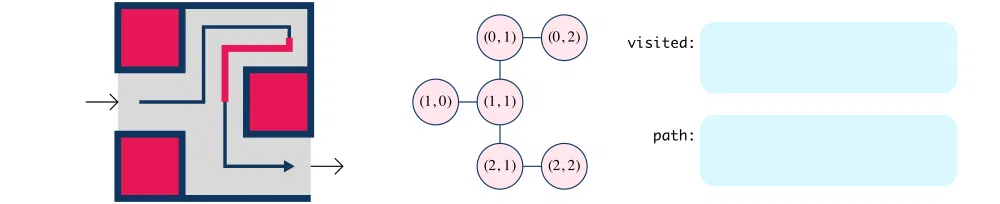

# Large animations

<!--
## GIF

## WebM

<video title="animated maze" width=700 autoplay loop muted playsinline>

 <source src="https://learn-2.galvanize.com/curriculum-download/a0b30920cbeba69a3e2fd613b9727bbb/webm" type="video/webm">

</video>

[WebM](images/MazeScene.webm)

## WebP

-->

## 15fps, high compression (290K)

## 15fps, default compression (851K)

## 60fps, default compression (2.5M)

